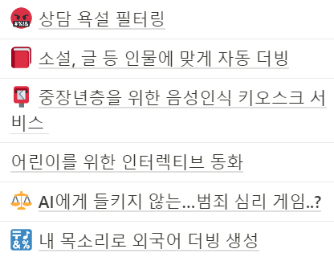

# 240828 기록

>- [1. 현직자 질문 작성](#1-현직자-질문-작성)
>   - [1-1. 일단 선정된 주제](#1-1-일단-선정된-주제)
>- [2. 추가적인 아이디어 생각하기](#2-추가적인-아이디어-생각하기)
>   - [2-1. 중장년층을 위한 음성인식 키오스크 서비스](#2-1-중장년층을-위한-음성인식-키오스크-서비스)
>   - [2-2. 내 목소리로 외국어 더빙 생성](#2-2-내-목소리로-외국어-더빙-생성)

# 1. 현직자 질문 작성
## 1-1. 일단 선정된 주제
### 프로파일링 서비스
- 용의자의 발언 전체 내용 기록 및 요약
    - STT 기술을 사용하여 용의자의 발언을 텍스트로 기록 후 요약하여 프로파일러에게 정보 제공
- 모순 찾기
    - 심문 동안 이전의 기록과 일치하지 않을 경우를 파악하여 용의자의 심문에서 모순 파악
- 감정이 변화하는 순간 자동 감지하여 기록
    - 용의자의 심문 내용에서 어조의 높낮이 변화 및 속도 변화 등에 따라 용의자의 감정 변화 파악 및 기록
---
- 기존의 심리 상담 보조 서비스를 살짝 변형하였다.
- 일단 인공지능을 활용한 웹 게임이 될 것 같다.

### 우려되는 점
- 게임을 개발하게 되면 리소스 탐색, 제작에 많은 시간이 들어가는 부분이 우려된다.
- 스토리나 대화 구성이 치밀해야 한다.

## 1-2. 작성한 질문
- 메인 주제와 관련된 질문
    - 심문 내용에서 모순을 찾으려고 하는데 Chat GPT와 같은 생성형 AI의 API를 사용하지 않고 구현하는 것이 가능할까요? 문장 간의 유사도를 구하는 모델로도 이를 구현하는 방향이 맞을까요?
    - 구어체 녹음본을 그대로 모델에 적용시켰을 때 발생하는 성능 저하나 정확도 문제가 발생할 거 같은데 어떻게 개선하는 것이 좋을까요?

- 추가 주제와 관련된 질문
    - 전화 통화 시 실시간으로 필터링 적용 시 발생하는 딜레이 문제와 이를 해결할 방안이 있는지 궁금합니다. (실시간 욕설 필터링)
    - RVC로 생성된 음성을 탐지할 수 있는 기술을 저희가 구현해 낼 수 있을까요?
    - MFCC로 감정 분석 알고리즘을 구현하려 하는데 어떤 어려움이 있을 수 있을까요?

# 2. 추가적인 아이디어 생각하기

- 기존에 나온 주제들이 하나씩 부족한 것 같아 각자 추가적인 주제를 찾기로 했다.
- 내가 찾은 주제는 아래와 같다.

## 2-1. 중장년층을 위한 음성인식 키오스크 서비스
### 개요
- 중장년층은 키오스크를 보며 주문하는 것을 어려워한다.
- 대신 메뉴판을 보고 대화로 주문하는 전통적인 방식을 익숙해한다.
- 인건비 등의 문제로 사람을 추가적으로 고용하기는 어렵다.
- 그러므로 음성으로 키오스크에서 주문을 할 수 있다면 좋다고 생각했다.

### 데이터셋 및 모델
- [극한 소음 음성인식 데이터](https://www.aihub.or.kr/aihubdata/data/view.do?currMenu=115&topMenu=100&aihubDataSe=data&dataSetSn=71417)
- [명령어 인식을 위한 소음 환경 데이터](https://www.aihub.or.kr/aihubdata/data/view.do?currMenu=115&topMenu=100&aihubDataSe=data&dataSetSn=71405)
- [명령어 음성(노인남여)](https://www.aihub.or.kr/aihubdata/data/view.do?currMenu=115&topMenu=100&aihubDataSe=data&dataSetSn=94)

### 유사 서비스
- [이미 나온 제품](https://www.youtube.com/watch?v=edanDfJm6q4)

## 2-2. 내 목소리로 외국어 더빙 생성
### 개요
- 다양한 국가의 시청자를 보유하고 있는 개인 방송인은 번역된 자막을 제공한다.
- 자막 대신 더빙된 오디오를 제공한다면 시청자의 만족도가 더 높아지지 않을까?
- 방송인의 오디오 → STT → 번역 → TTS → RVC를 거쳐 더빙된 오디오를 생성
- 꼭 라이브 방송이 아니라 유튜브 같은 영상에 활용해도 됨

## 참고자료
- [VOCO](https://cse.ewha.ac.kr/cse/academic/graduation-work.do?mode=view&articleNo=688427&article.offset=18&articleLimit=9)
- [HeyGen의 Video translate](https://jamake.io/ko/insight/131)
    - 이거 보니까 배경음이나 잡음 제거가 필요할 것 같다.
