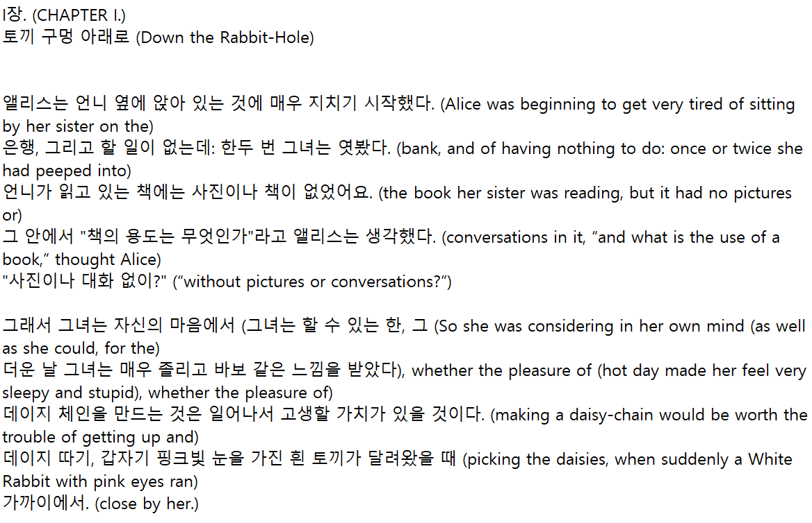
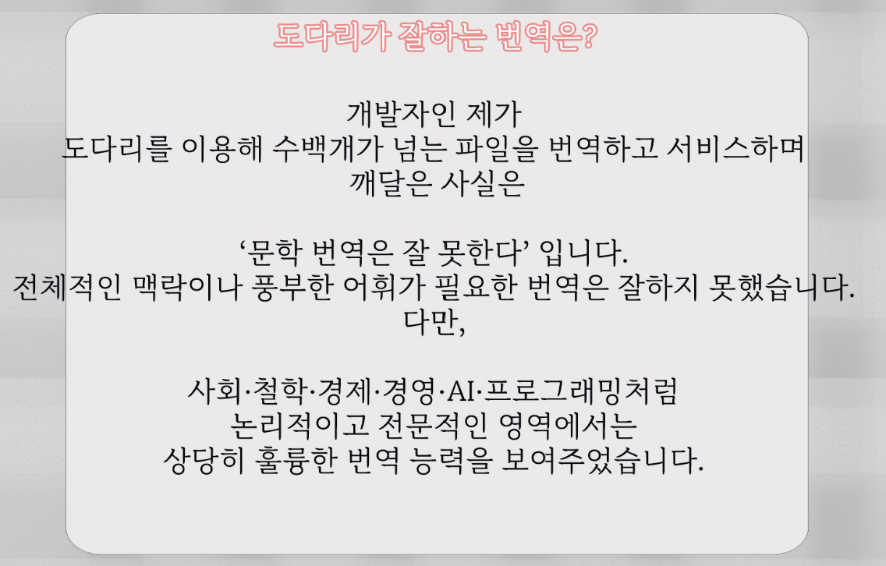
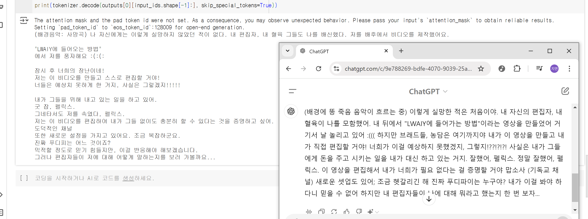

# 240902 기록

> - [1. 한 일](#1-한-일)
> - [2. 도다리](#2-도다리)
> - [3. korean bllossom](#3-korean-bllossom)

# 1. 한 일
번역 모델의 성능이나 소요 시간 등을 직접 시험해보고 사용 가능성을 점검해보았다.

# 2. 도다리
## 개요
- 한영/영한 번역기인 [도다리](https://github.com/vEduardovich/dodari)를 설치하고 사용해봤다.
- NHNDQ를 사용했다고 한다.

## 에러
>OSError: [WinError 126] 지정된 모듈을 찾을 수 없습니다. Error loading "C:\Users\SSAFY\Desktop\project\dodari\venv\Lib\site-packages\torch\lib\fbgemm.dll" or one of its dependencies.

- 세팅을 하려고 하는데 요런 에러가 발생했다.
- stackoverflow에서 [해결방법](https://stackoverflow.com/questions/78114412/import-torch-how-to-fix-oserror-winerror-126-error-loading-fbgemm-dll-or-depen)을 찾을 수 있었다.

## 번역 결과

- 루이스 캐럴의 [이상한 나라의 앨리스](https://www.gutenberg.org/ebooks/11) 영어 원서를 넣었다.
- 깃헙에 나온 예시보다 더 어색한 느낌이 들었다.

## 문제점

- [도다리 고급 번역 사이트](https://moonlit.himion.com/dodari?utm_campaign=goto_moonlit&utm_source=github&utm_medium=link&utm_content=dodari_landing_page)에 나온 안내를 보게됐다.
- 대놓고 문학 번역은 잘 못한다고 되어있다.
- 코딩 유튜버의 경우 전문적인 영역이긴 하지만 문헌마냥 완전히 정리된 글이 아니다.
    - 대본이 있다한들 자연스럽게 말로 전달하는 방식인 만큼 도다리는 이용이 어렵다는 결과를 내렸다.

# 3. korean bllossom
## 개요
- 한국어-영어 이중 언어모델인 [Korean Bllossom 8B](https://huggingface.co/MLP-KTLim/llama-3-Korean-Bllossom-8B)에 대해 시험을 해봤다.
- 학습 데이터량이 많아서 기대가 된 모델이었다.

## 번역 결과
- 실제 외국 유튜버의 영상을 쓰면 좋겠다는 생각이 들어서 [PewDiePie의 영상](https://www.youtube.com/watch?v=ZXJshpnCutc)에 달린 캡션을 일부 따와서 모델에 넣어봤다.

---

- 왼쪽은 bllossom이 내놓은 결과고 오른쪽은 ChatGPT가 내놓은 결과다.
- 원문 자체가 난잡해서 번역이 쉽진 않았지만 ChatGPT의 결과가 꽤 좋아서 놀랐다.
- bllossom은 huggingface나 AI Hub에서 적절한 데이터를 찾아서 추가적으로 학습시켜야 할 것 같다.
    - AI Hub에서는 [이 데이터](https://www.aihub.or.kr/aihubdata/data/view.do?currMenu=115&topMenu=100&aihubDataSe=data&dataSetSn=71668)가 쓸만해보인다.

