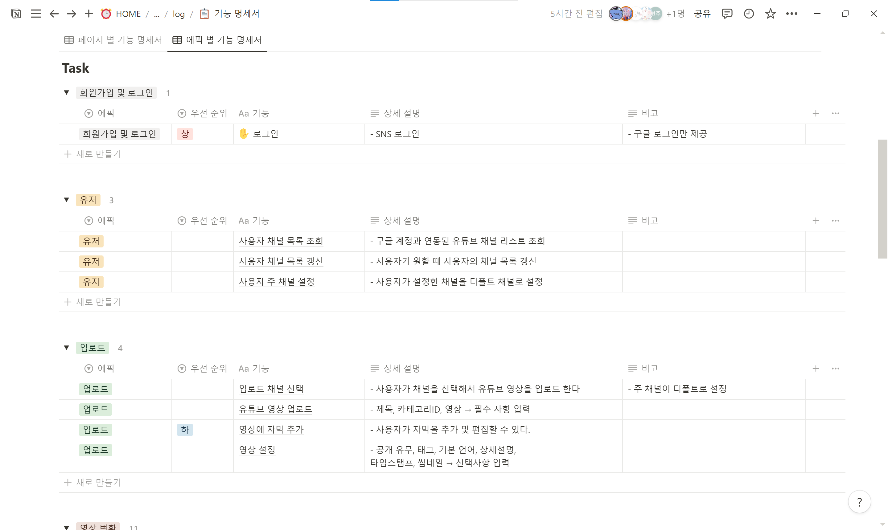
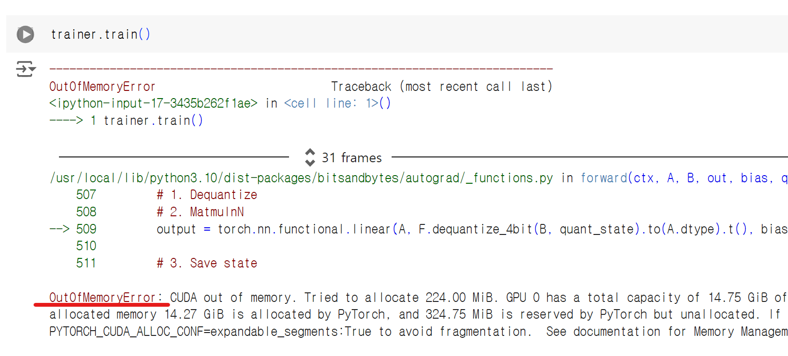

# 240903 기록

> - [1. 모델 조사](#1-모델-조사)
>    - [T5](#t5text-to-text-transfer-transformer)
>    - [LLaMA](#llamalarge-language-model-meta-ai)
>    - [Alpaca](#alpaca)
>    - [결론](#결론)
> - [2. 기능 명세서 작성](#2-기능-명세서-작성)
> - [3. LLaMA 파인튜닝 찍먹](#3-llama-파인튜닝-찍먹)

# 1. 모델 조사
- 이런 저런 모델을 직접 사용해보니 그대로는 사용할 수 없고 파인튜닝이 필수임을 느꼈다.
- 파인튜닝에 많은 시간이 걸리니까 처음부터 좋은 모델을 골라야겠다는 생각이들어 조사를 했다.

## T5(Text-To-Text Transfer Transformer)
- Google에서 개발한 모델
- 한영 번역에 적합하다.
- 다양한 문맥을 잘 이해할 수 있다.
- 최근에는 성능이 더 좋은 [t5x](https://github.com/google-research/t5x)가 나온 것 같다.

## LLaMA(Large Language Model Meta AI)
- Meta에서 개발한 모델
- 좋은 성능을 보여주지만 번역 부분에 대해서는 T5보다 품질이 떨어질 수 있다.
- 비정형적인 텍스트에 대해 잘 대응할 수 있다.

## Alpaca
- LLaMA를 기반으로 특정 작업에 대해 파인 튜닝된 모델
- 대화체 번역에 더 좋은 성능을 보일 수 있다.

## 결론
- GPT는 Alpaca를 추천하긴 했는데 한국어-영어가 함께 학습된 모델은 찾지 못했다.
- 일단 T5와 LLaMA를 우선적으로 사용하기로 했다.

# 2. 기능 명세서 작성

- 팀원들끼리 회의를 하며 기능명세서를 작성했다.
- 다시 한 번 리스트업의 중요성을 느꼈다.
    - 의견이 일치하지 않은 부분이 계속 발견되어 회의에 많은 시간이 소요됐다.
    - 회의를 늦게했다면 일이 커졌을지도…?

# 3. LLaMA 파인튜닝 찍먹
- [친절한 영어-한국어 번역기 만들기](https://metamath1.github.io/blog/posts/gentle-t5-trans/gentle_t5_trans.html?utm_source=pytorchkr&ref=pytorchkr)를 참고
- [
llama-3-Korean-Bllossom-8B](https://huggingface.co/MLP-KTLim/llama-3-Korean-Bllossom-8B) 모델을 [
korean_english_parallel_wiki_augmented_v1](https://huggingface.co/datasets/lemon-mint/korean_english_parallel_wiki_augmented_v1) 데이터셋을 이용해 파인튜닝을 시도했다.
---

- colab에서 기본 제공하는 메모리로는 학습이 어려운 것 같다.
- 다른 방법을 계속 찾아봐야할 것 같다.
