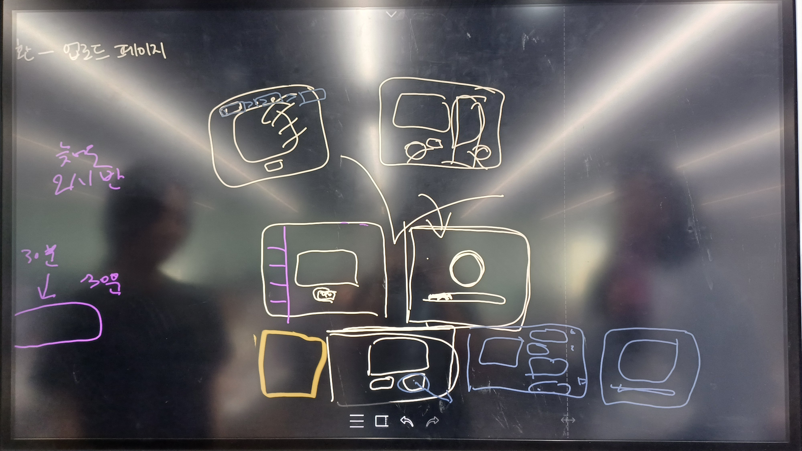
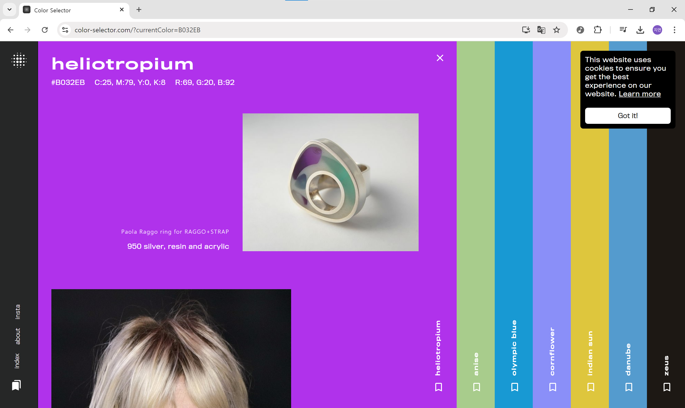
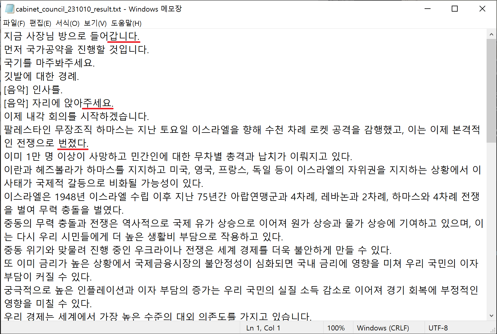
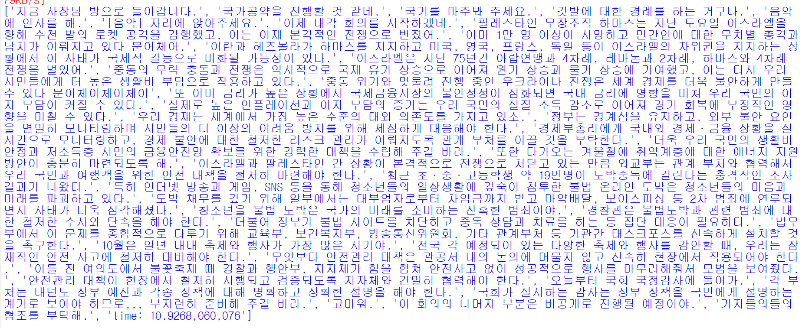
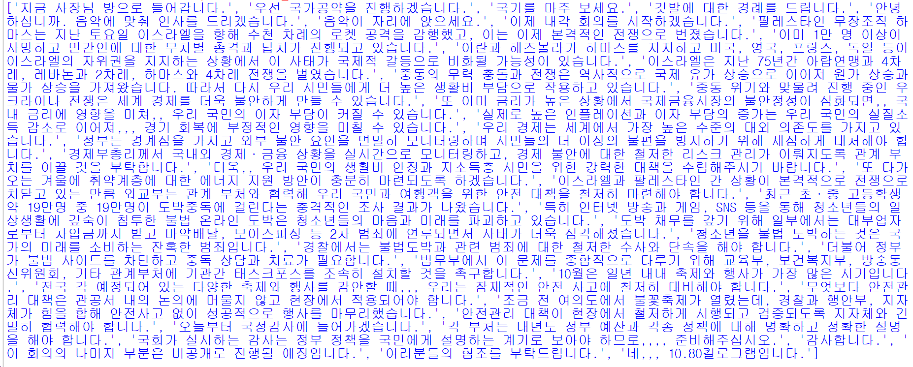

# 240903 기록

> - [1. 와이어프레임 구성](#1-와이어프레임-구성)
>    - [1-1. 페이지 목록](#1-1-페이지-목록)
>       - [1-1-1. 마이 페이지](#1-1-1-마이-페이지)
>        - [1-1-2. 더빙 생성 페이지](#1-1-2-더빙-생성-페이지)
>    - [1-2. 레이아웃 레퍼런스](#1-2-레이아웃-레퍼런스)
> - [2. KoTAN 테스트](#2-kotan-테스트)
>   - [2-1. 개요](#2-1-개요)
>   - [2-2. 단순 번역 결과](#2-2-단순-번역-결과)
>   - [2-3. 문체 변환](#2-3-문체-변환)
>     - [2-3-1. formal(문어체)](#2-3-1-formal문어체)
>     - [2-3-2. gentle(신사)](#2-3-2-gentle신사)
>   - [2-4. 임시 결론](#2-4-임시-결론)

# 1. 와이어프레임 구성

## 1-1. 페이지 목록
### 1-1-1. 마이 페이지
- 연동 계정 관리
    - 회원 정보 확인
    - 회원 탈퇴
- 음성 학습 데이터 관리
    - 내 음성 업로드
    - 더빙 예시 미리듣기
- 채널 관리
    - 채널 목록 조회
    - 주 업로드 채널 설정
### 1-1-2. 더빙 생성 페이지
- 원본 영상 업로드
- 스크립트 편집
- 로딩 페이지
    - 페이지 하나를 구상할지 하니면 팝업처럼 따로 띄울지 고민 중
- 결과 미리보기 및 다운로드
- 유튜브 업로드 설정
- 유튜브 업로드 결과 확인
    
## 1-2. 레이아웃 레퍼런스
### [color-selector.com](https://www.color-selector.com/)

- 각 컬러 책갈피(?)를 클릭하면 왼쪽으로 펼쳐지면서 내부 콘텐츠를 볼 수 있다.

### [tempergroup.com](https://www.tempergroup.com.au/?ref=onepagelove)

- color-selector와 비슷하게 좌우로 펼쳐지는 레이아웃 형태
- 이런 컴포넌트를 horizontal accordion이라고 하는 것 같다.

# 2. KoTAN 테스트
## 2-1. 개요
- 페이스북의 [NLLB](https://arxiv.org/abs/2207.04672) 모델을 파인튜닝한 [KoTAN](https://github.com/trailerAI/KoTAN)을 사용해봤다.
- 라이브러리 설치만하면 간단하게 사용할 수 있다는 점이 매우 좋았다.
- [8분짜리 국무회의 라이브](https://www.youtube.com/watch?v=UpyMwehpPyc)를 GPT를 통해 한-영 번역시키고 이를 KoTAN으로 다시 영-한 번역을 해봤다.

## 2-2. 단순 번역 결과

- 공백 제외 4222자, 공백 포함 4994자를 번역하는데 대략 12초가 걸렸다.
    - 동일 텍스트에 대해 GPT는 85초가 소요됐다.
    - 속도면에서는 만족스러웠다.
- 다만 번역 품질은 영 좋지 못했다.
- 문체가 일관적이지 않는 문제가 존재했다.
    - 하십시오체, 해요체, 해라체로 3개의 문체가 등장했다.

## 2-3. 문체 변환
### 2-3-1. 개요
- KoTAN이 문체 변환 기능도 함께 제공하고 있다.
- 초벌 번역 결과를 문체 변환으로 다듬어보기로 했다.

### 2-3-1. formal(문어체)

- 기존 번역문보다 더 이상해졌다.
- 왜 갑자기 반말이 튀어나왔는지 모르겠다.

### 2-3-2. gentle(신사)

- 드디어 원하는 결과가 나왔다.
- 일반적인 정보전달 영상은 gentle 스타일로 다듬으면 될 것 같다.

## 2-4. 임시 결론
- 번역 모델은 다른 것을 쓰더라도 문체 변환은 KoTAN으로 해주면 될 것 같다.
    - 사용량이 적고 검색결과가 없어서 걱정을 했는데 결과가 만족스럽다.
    - 다른 모델이 있는지도 찾아봐야 겠다.
- 내일은 [KoAlpaca](https://github.com/Beomi/KoAlpaca)를 시험할 예정이다.