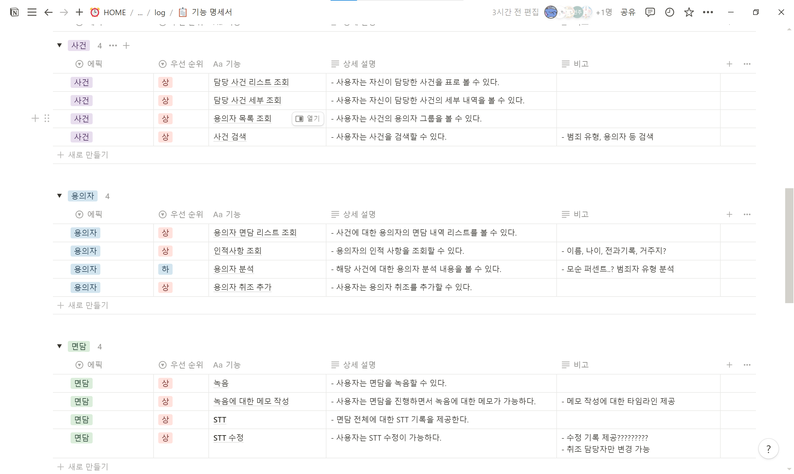
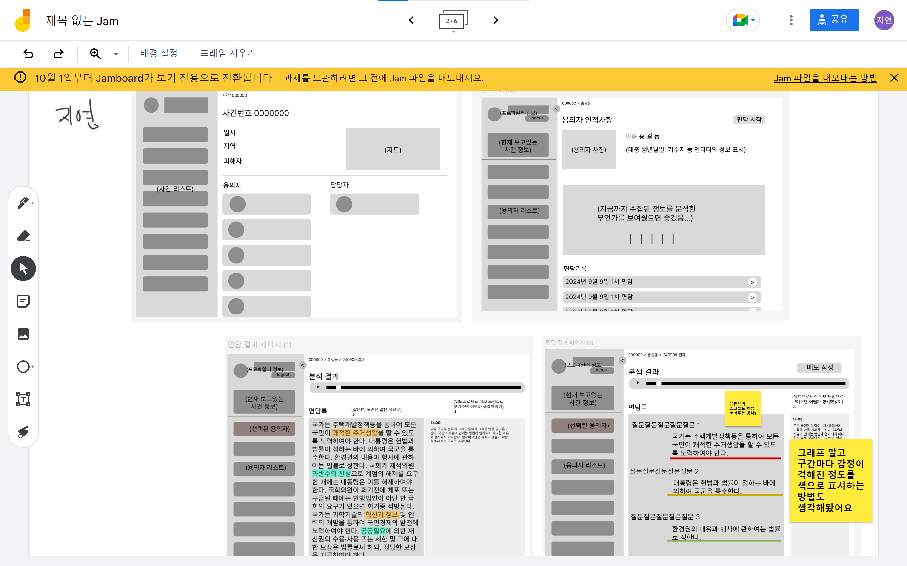

# 240909 기록

> - [1. 기능 명세서 작성](#1-기능-명세서-작성)
> - [2. 팀 미팅](#2-팀-미팅)
> - [3. 와이어프레임 구상](#3-와이어프레임-구상)

## 1. 기능 명세서 작성

- 주말동안의 회의를 통해 '프로파일링 보조 서비스'를 주제로 정했다.
- 사건 조회, 용의자 조회, 면담 관리가 주요 기능이다.
- 용의자 신문 녹음본을 분석하여 분석 레포트를 제공한다.

## 2. 팀 미팅
### 좋은점
- 기존에 제공하는 서비스가 없다 보니까 좋다.
- 이전 주제는 비슷한 서비스가 존재하다 보니 특출난 차별점이 필요했는데 그런 부분에서는 좋다.

### 향후 계획
- 추가 기능까지 생각한다면 수사 과정 중 물적 증거까지 통합 관리할 예정.
- 시간이 부족하므로 최대한 빠르게 프로토타입 만들고 프로토타입에 붙이자.
- 기획 근거를 준비하자.
- 서비스 핵심 가치를 잘 생각해보자.
- 화면이 **임팩트** 있게 보여졌으면 좋겠다.
- 커뮤니티 같은 느낌이 나지 않았으면 좋겠다. 한 눈에 보이게……;-;
- AI는 찍먹보다는 성능 향상에 고민을 해보자.

### 부족한점
- 프로파일링에 대해 좀 더 전문적인 정보를 들고 가는 것이 좋겠다.
- 더미 데이터보다는 실제 데이터를 가지와 사용하는 게 제일 좋다.
- 현직자 혹은 전직자에게 연락이 닿지 않으면 그 정도의 자료조사를 했다고 어필 필요.

## 3. 와이어프레임 구상

- 디자인을 맡은 팀원들이 각자 와이어프레임을 구상하고 의견을 통합하기로 했다.
- 한 페이지에 표현해야 할 정보가 많아서 어려웠다.
- 특히 분석 결과의 감정 그래프 표현이 어려웠다.