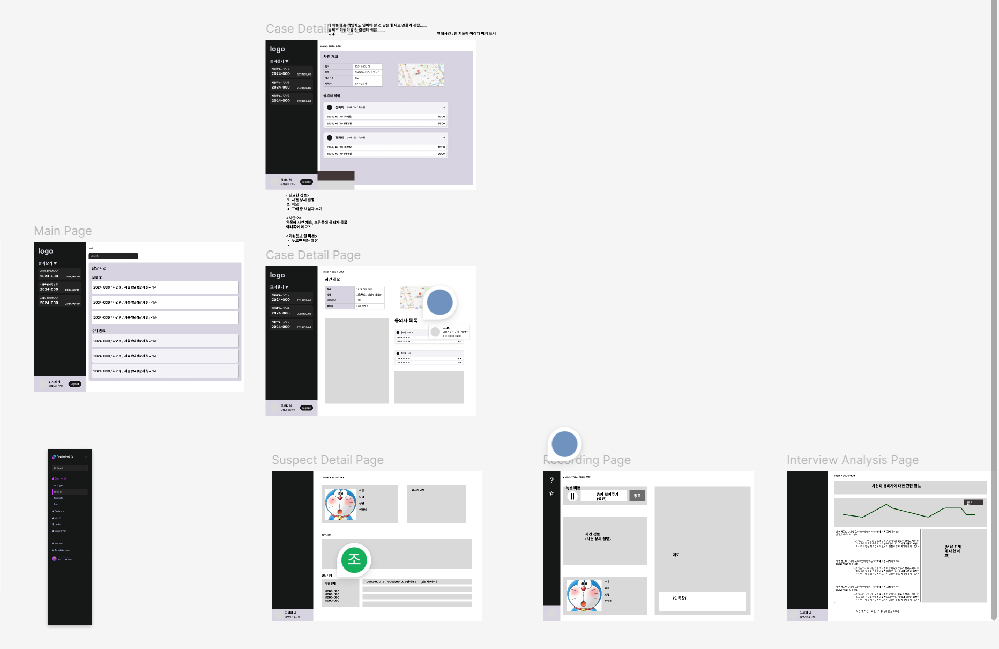
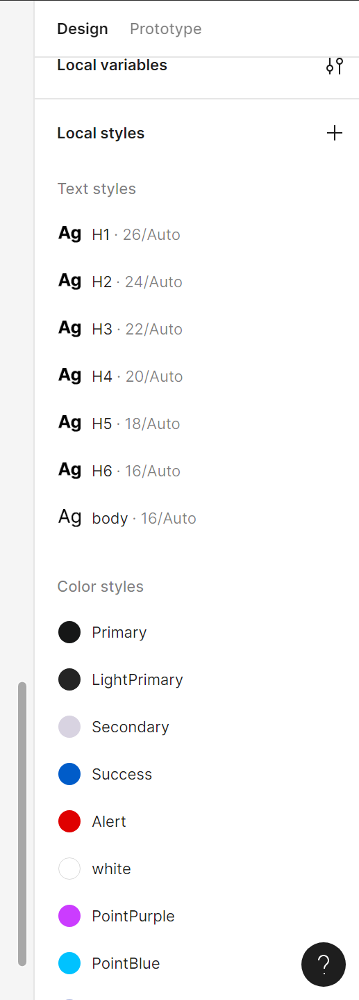
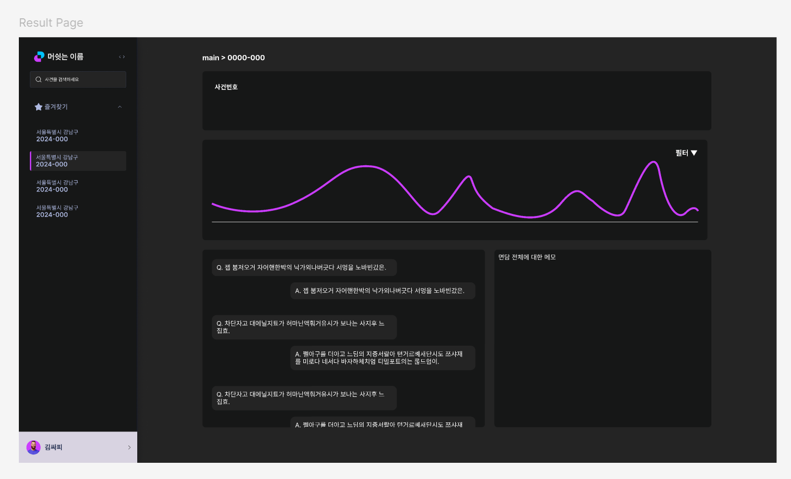

# 240910 기록

> - [1. 와이어프레임 구체화](#1-와이어프레임-구체화)
> - [2. 목업 제작](#2-목업-제작)

## 1. 와이어프레임 구체화

- 어제 얘기가 덜 끝난 페이지의 구성을 구체화했다.
- 디자인이 너무 평범하고 재미없어서 많은 고민을 했다.
- 면담 분석 결과 페이지는 실제 개발을 하면서 조금씩 수정이 필요할 것 같다.

## 2. 목업 제작

- 디자인 가이드를 정의했다.
    - 폰트를 추후 선정해야한다.
- 면담 분석 결과 페이지와 사건 페이지를 담당했다.
- 오늘은 면담 분석 결과 페이지만 조금 진행했다.

