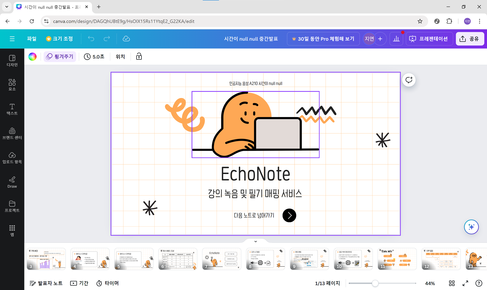

# 240912 기록

> - [1. 오전 팀 미팅](#1-오전-팀-미팅)
> - [2. 긴급 기획 회의 😥](#2-긴급-기획-회의-😥)
>   - [2-1. 한 줄 소개](#2-1-한-줄-소개)
>   - [2-2. 기획 근거](#2-2-기획-근거)
>   - [2-3. 페르소나](#2-3-페르소나)
>   - [2-4. 요구사항 리스트](#2-4-요구사항-리스트)
>   - [2-5. Output](#2-5-output)
> - [3. 오후 팀 미팅](#3-오후-팀-미팅)
>   - [3-1. 페르소나](#3-1-페르소나)
>   - [3-2. 주제에 대해](#3-2-주제에-대해)
> - [4. 중간발표 자료 제작]()

# 1. 오전 팀 미팅
- 프로파일링 보조 서비스에 대해 컨설턴트님과 팀 미팅을 진행하였다.
- 근거가 너무 불분명하다는 지적을 받았다.
    - 근거가 부족하면 이 서비스가 좋은지 나쁜지 판단할 수 없다.
- UI/UX도 프로파일러를 위한 구성이라고 볼 수 없다.
- 녹음 중에 작성한 메모를 같이 볼 수 있는 부분은 좋다고 해주셨다.
- 우리 서비스의 가치가 무엇이고 **'왜 이렇게 해야하는가'**를 계속 생각하는 게 중요함을 느낀 좋은 시간이었다.

# 2. 긴급 기획 회의 😥
## 2-1. 한 줄 소개
- 녹음 · 필기 매핑 서비스

## 2-2. 기획 근거
- 코로나 19 이후 손 필기 대신 노트북 필기를 이용하는 비중이 증가함.
- 녹음본이 있어도 내가 원하는 부분을 찾아 듣기가 어렵다
- 필기가 오래걸린다. 타이핑이 너무 많다.
    - 손 필기로는 교수님의 말씀을 따라가기 어렵다.

## 2-3. 페르소나
- 필기할 양이 많은 강의를 듣는 대학생

## 2-4. 요구사항 리스트
### 강의록이 있었으면 좋겠어요
- STT를 이용한 강의 스크립트 제공
- 살짝 딜레이가 있는 실시간의 형태로 제공
- 일단 STT가 실시간으로 돌아가면서 수정도 가능하도록

### 이 메모를 언제 작성했는지 알고 싶어요
- STT와 메모를 매핑
- 녹음 시작을 기점으로 메모를 작성한 시점을 기록
    - 약간 타임스탬프 찍는 느낌?
### 중요한 부분을 표시해줬으면 좋겠어요

- 특정 단어(시험, 중요 등)를 기반으로 강조
    - 키워드를 사용자가 설정하도록
    - 기본 키워드 제공
- 교수님의 음성(피치, 크기 등)을 바탕으로 강조하시는 부분을 캐치

## 2-5. Output
- 메모가 함께 들어간 강의자료 PDF (추후 계획)
    - 왼쪽에는 강의자료, 오른쪽에는 메모로 나눠서 표시
    - 메모를 작성한 시각도 같이 표시
- 강의 녹음본
- 강의록 텍스트

# 3. 오후 팀 미팅
## 3-1. 페르소나
- 수험생 페르소나를 추가해도 괜찮을지도?
    - 디지털 학습자료를 사용하는 학생쪽으로 타겟을 넓혀보는 것도 생각해보자
- 페르소나를 너무 한정지으면 서비스에 공감하기 힘들어진다.
- 필기할 양이 많은 대학생을 주 타겟으로 잡아보기.

## 3-2. 주제에 대해
- 굿👍
- **‘유저 입장’**에서 이 서비스를 어떻게 사용하게 될지를 좀 더 생각해보자.
- 마지막으로 보여지는 **결과물**에 대해서도 구체적으로 생각해보자.
    - 필기 느낌을 살려줄 수 있는 방안으로
    - 타이핑에만 국한하지 말자
- 웹앱으로 개발하는 방안도 생각해보자
    - 반응형 생각하지말고 하나의 디바이스에만 맞춰서 개발

# 4. 중간발표 자료 제작

- 정해진 기획을 바탕으로 빠르게 중간발표 자료를 제작했다.
- 서비스명은 EchoNote로 녹음(Echo)과 메모(Note)를 결합했다.
    - 사용자에게 강의 내용을 다시 들으며 메모를 쉽게 할 수 있다는 느낌을 주고자 했다.