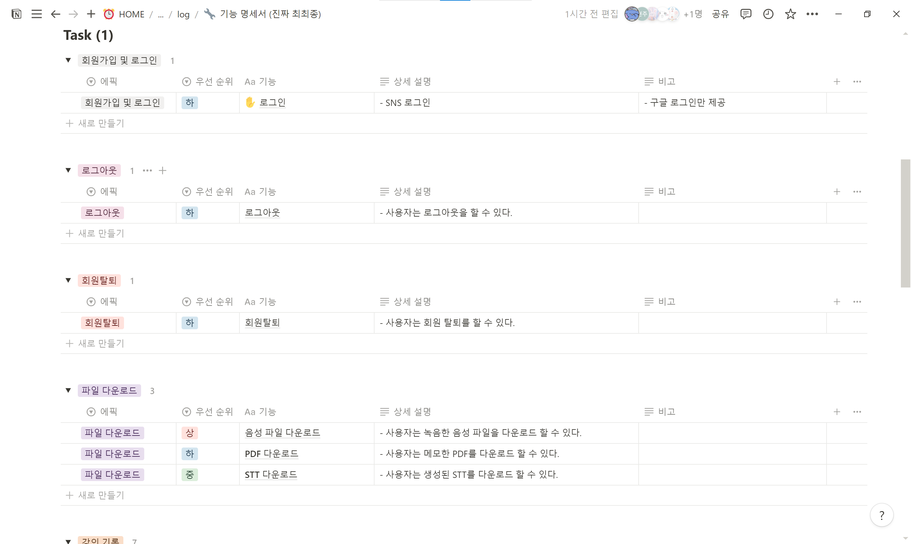

# 240913 기록

> - [1. 중간 발표](#1-중간-발표)
>   - [1-1. QnA](#1-1-qna)
>   - [1-2. 컨님의 피드백](#1-2-컨님의-피드백)
> - [2. 기능 명세서 작성](#2-기능-명세서-작성)

# 1. 중간 발표
- 중간 발표를 수행했다. (다솔최고b)

## 1-1. QnA
- 실시간으로 STT를 수정하는 기능을 제공한다고 했는데 수정할 부분이 계속 위로 밀려서 불편함이 생기지 않을지?
    - UI 부분은 아직 진행하지 않아서 추후 고민할 예정.
- 클로바 노트와의 차별점이 무엇인지?
    - 타이핑 외에도 손으로 필기하는 기능을 제공하려고 한다.
    - 웹을 기반으로 개발하여 기기 제한이 없도록 할 예정.

## 1-2. 컨님의 피드백
- 대학강의를 이렇게 열심히 듣는지 몰랐다…
- 다른 사람들에게 납득이 될 만한 기획 설계에 대한 발표는 아니었다.
- 시간이 너무 짧아서 성의 없어 보임 😢
- UI/UX 잘 풀어내자.

# 2. 기능 명세서 작성

- 중간발표 후 남는 시간동안 빠르게 기능 명세서를 작성했다.
- 일단 대략적으로 작성했고 추후 서비스를 구체화하면서 다듬어야겠다.