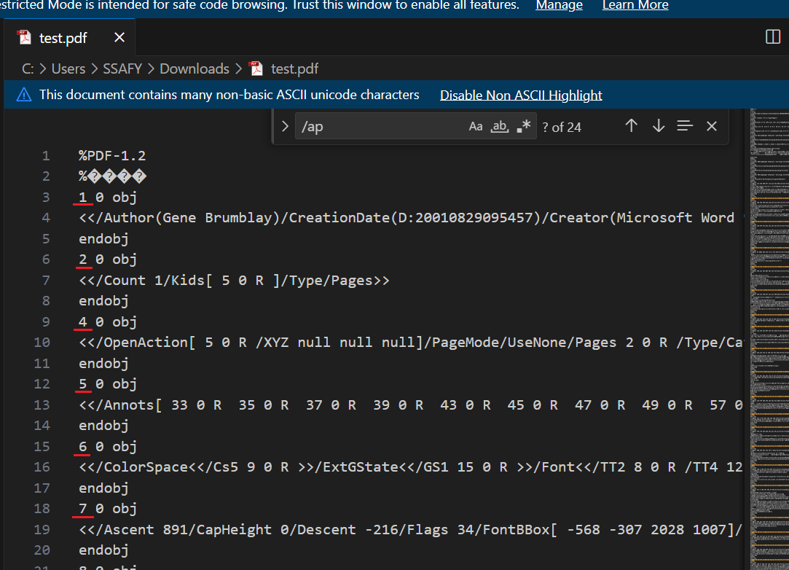
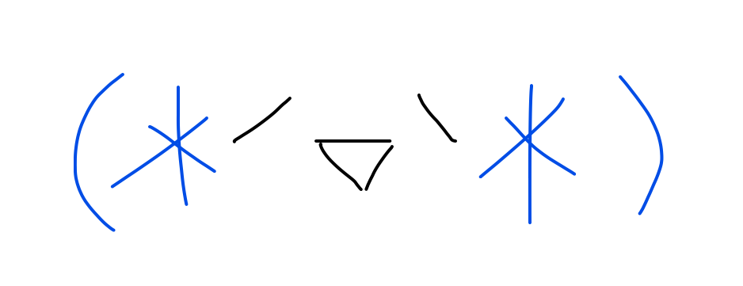

# 240919 기록

> - [1. 참고링크](#1-참고링크)
> - [2. 전체적인 방식](#2-전체적인-방식)
>   - [2-1. 주석을 관리하는 방식](#2-1-주석을-관리하는-방식)
>   - [2-2. Apperance Stream의 구조](#2-2-apperance-stream의-구조)
>   - [2-3. Apperance Stream의 타입](#2-3-apperance-stream의-타입)
>   - [2-4. 주석의 페이지 정보](#2-4-주석의-페이지-정보)
>   - [2-5. 주석 관련 실제 코드](#2-5-주석-관련-실제-코드)
> - [3. 페이지를 관리하는 방식](#3-페이지를-관리하는-방식)
>   - [3-1. 개요](#3-1-개요)
>   - [3-2. 예시](#3-2-예시)


# 1. 참고링크
- [[PDF] 문서 구조 형태](https://blog.naver.com/stop2y/221280356184)
- [The PDF Format](https://pypdf2.readthedocs.io/en/3.0.0/dev/pdf-format.html)
- [PDF File Structure Analysis](https://blog.forensicresearch.kr/4)
- [PDF 파일 구조 분석](https://nurilab.github.io/2021/05/16/fileformat_pdf/)
- [PDF 페이지에서 주석 검색](https://reference.aspose.com/tutorials/pdf/ko/java/pdf-annotations/retrieve-annotations-pdf-pages/)
- [PDF 포맷 분석 정리](https://tmxhsk99.tistory.com/221)

# 2. 전체적인 방식

- pdf 파일은 텍스트 에디터로 열어 그 구조를 확인할 수 있다.
- 모든 객체들은 다음과 같은 구조를 갖는 것 같다.
    
    ```
    *ObjectNumber* *GenerationNumber* obj
    <<
    	(대충 내용?)
    >>
    endobj
    ```
    
    - Object Number는 각 객체를 식별하는 번호이다.
    - Generation Number는 해당 객체의 버전 또는 세대를 나타낸다.
        - PDF에서 객체가 처음 생성될 때는 항상 0으로 시작된다.
        - 후에 객체가 수정되거나 삭제 후 재생성되면 번호가 증가하게 된다.
        - 이를 통해 특정 시점의 상태를 쉽게 복구하거나 추적할 수 있다.
    - 이 Object Number는 다른 객체에서 참조할 수 있다.

## 2-1. 주석을 관리하는 방식

- `Appearance Stream`이라는 명령어로 관리된다.
    - PDF 문서 내에서 객체의 외관을 기술하는 그래픽 명령어의 집합
    - 주석, 폼 필드 등을 표현할 대 사용된다.
- PDF 뷰어는 Appearance Stream을 읽어들여 주석을 화면에 그려낸다.
- `/AP`는 **Appearance Stream**을 나타내는 키로, 주로 주석이나 폼 필드의 시각적 표현을 기술한다.

## 2-2. Apperance Stream의 구조

- **Bounding Box** (`/BBox`): Appearance Stream의 시각적 영역을 정의합니다. 객체가 차지하는 공간의 크기를 나타내며, 이 값에 따라 객체의 렌더링 범위가 결정됩니다.
- **Matrix** (`/Matrix`): Appearance Stream의 좌표 변환을 정의하는 행렬입니다. 이 행렬을 통해 그래픽 요소를 이동, 회전, 크기 조정할 수 있습니다.
- **Contents**: Appearance Stream의 핵심 부분으로, PDF의 그래픽 명령어를 통해 객체의 외관을 정의합니다. 여기에는 선, 도형, 텍스트, 이미지 등의 요소가 포함될 수 있습니다.

### **예시**

```
/AP << 
   /N << /BBox [0 0 100 50]
          /Matrix [1 0 0 1 0 0]
          /Resources << /Font << /F1 10 0 R >> >>
          /Contents 20 0 R >>
>>
```

### **실제 코드**

```
19 0 obj
<</AP<</N 18 0 R >>/BS<</W 2>>/C[ 0 0.301961 0.901961]/CA 1/F 4/InkList[[ 114.75 511.5 114.75 511.627 114.75 512.116 114.75 513.084 114.75 514.255 114.75 515.647 114.877 517.296 115.43 519.366 116.419 521.741 117.905 524.312 119.705 526.734 121.548 528.862 123.354 530.608 124.898 531.93 126.112 532.815 127.019 533.332 127.809 533.576 128.47 533.516 129.019 533.121 129.608 532.309 130.437 531.042 131.436 529.446 132.796 527.382 134.425 524.988 136.102 522.646 137.773 520.218 139.349 517.968 140.672 516.19 141.899 514.694 142.934 513.531 143.76 512.668 144.469 512.038 145.126 511.631 145.646 511.278 146.136 511.076 146.91 511.047 148.46 511.492 150.708 512.48 153.369 513.764 156.04 515.105 158.707 516.438 161.174 517.795 163.313 519.124 165.243 520.533 166.932 521.805 168.404 523.112 169.581 524.469 170.475 525.811 171.202 527.11 171.723 528.293 172.051 529.281 172.228 530.194 172.299 530.98 172.305 531.631 172.277 532.104]]/Rect[ 113.729 509.977 173.312 534.607]/Subtype/Ink/Type/Annot>>
endobj
```

- `/AP`는 주석이나 폼을 의미한다.
- `/C`는 RGB 컬러를 나타낸다.
    - 일반적으로는 0~255의 범위로 표현하지만 pdf는 0.0~1.0의 범위로 표현한다.
    - `/InkList`는 좌표를 의미하는 것 같다?

## 2-3. Apperance Stream의 타입
- **Normal Appearance (`/N`)**: 주석이나 필드의 기본 상태를 나타냅니다. 기본적으로 보여지는 외관을 정의합니다.
- **Rollover Appearance (`/R`)**: 마우스를 주석이나 폼 필드 위에 올렸을 때의 외관을 정의합니다.
- **Down Appearance (`/D`)**: 주석이나 폼 필드가 클릭되었을 때의 외관을 정의합니다.

## 2-4. 주석의 페이지 정보
```
351 0 obj
<</AP<</N 355 0 R >>/BS<</S/S/Type/Border/W 0>>/Border[ 0 0 0]/CA 1/Contents<646F75626C6520776F7264>/CreationDate<443A32303231303930323136353031352B303927303027>/DA<3020302E343339323135363836323734353120302E37353239343131373634373035383820524720203020302E343339323135363836323734353120302E37353239343131373634373035383820726720202F48656C76203135205466>/F 4/FillOpacity 0/IC[ 0 0 0]/M<443A32303231303930323136353031352B303927303027>/NM<35316331383030392D616232312D343431352D383233622D336362393239623333363432>/P 27 0 R /Rect[ 386.981 150.379 522.972 171.782]/Rotation 0/Subj<5465787420426F78>/Subtype/FreeText/T<53696E204A6979656F6E>/TextColor[ 0 0.439216 0.752941]/Type<416E6E6F74>>>
endobj
```

- `/P` 속성을 통해 이 주석이 포함된 페이지 객체에 대한 참조를 확인할 수 있다.
- 페이지 트리를 분석하여 27번 객체가 몇번째 페이지인지 보면 된다.

## 2-5. 주석 관련 실제 코드


```
5 0 obj
<</Annots[ 33 0 R  35 0 R  37 0 R  39 0 R  43 0 R  45 0 R  47 0 R  49 0 R  57 0 R  59 0 R  61 0 R  63 0 R  65 0 R ]/Contents 10 0 R /CropBox[ 0 0 612 792]/MediaBox[ 0 0 612 792]/Parent 2 0 R /Resources 6 0 R /Rotate 0/Type/Page>>
endobj
```

- 총 13획을 그렸고 `/Annots` 배열을 보면 13개의 주석 Object 정보들이 있음을 볼 수 있다.
- `R` 은 간접 객체 참조를 의미한다.
    - `33 0 R`은 33번 객체의 0세대를 참조한다는 의미이다.
    - 이 객체는 실제로 PDF 파일 내의 다른 위치에 정의되어 있으며, `33 0 obj`로 시작하는 객체를 찾으면 그 주석 객체의 세부 정보를 확인할 수 있다.

# 3. 페이지를 관리하는 방식

## 3-1. 개요
- 페이지는 **페이지 트리(Page Tree)**라는 트리 구조로 관리된다.
- 이 과정에서 페이지가 여러 그룹으로 나누어진다.

## 3-2. 예시

```
3 0 obj
<</Count 8/Kids[ 2 0 R  27 0 R  34 0 R  39 0 R  44 0 R  49 0 R  54 0 R  59 0 R ]/Parent 316 0 R /Type/Pages>>
endobj

65 0 obj
<</Count 4/Kids[ 64 0 R  70 0 R  75 0 R  80 0 R ]/Parent 316 0 R /Type/Pages>>
endobj

316 0 obj
<</Count 12/Kids[ 3 0 R  65 0 R ]/MediaBox[ 0 0 720 540]/Type/Pages>>
endobj
```

- 페이지 번호는 `/Pages` 트리 구조에 따라 결정된다.
- 페이지 트리와 관련된 객체들은 `/Type /Pages`를 타입으로 갖는다.
    - 실제 페이지 객체는 `/Kids` 배열을 통해 나열된다.
- 페이지 트리의 루트 객체는 `/Perent`를 갖지 않는듯?
- 실제 페이지 객체들의 순서는 다음과 같다
    - `2 0 R` , `27 0 R` , `34 0 R` , `39 0 R` , `44 0 R` , `49 0 R` , `54 0 R` , `59 0 R`
    - 해당 Object Number를 따라서 가면 페이지의 각종 정보들을 볼 수 있다.
