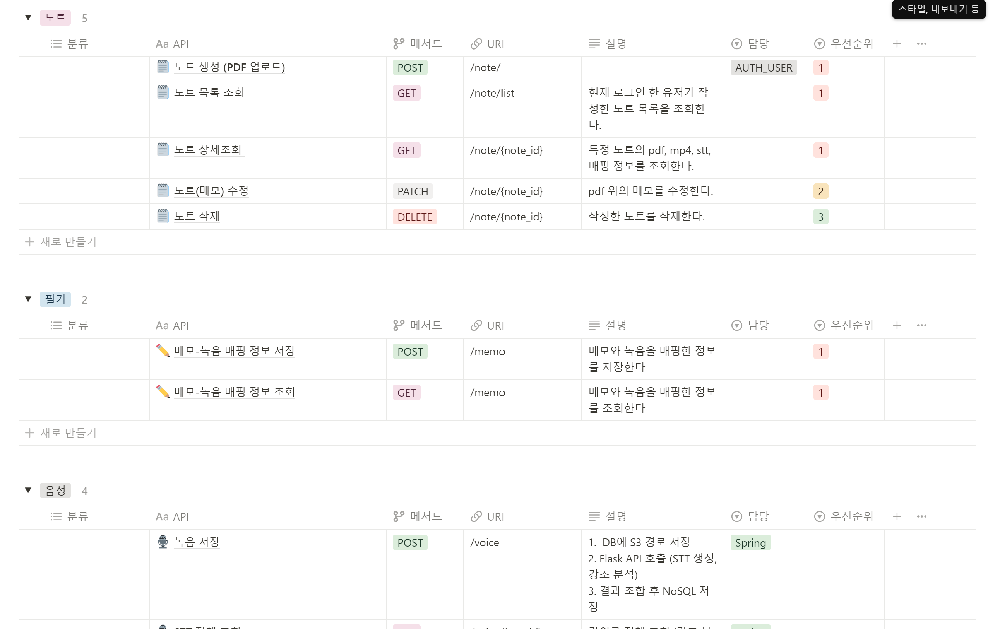
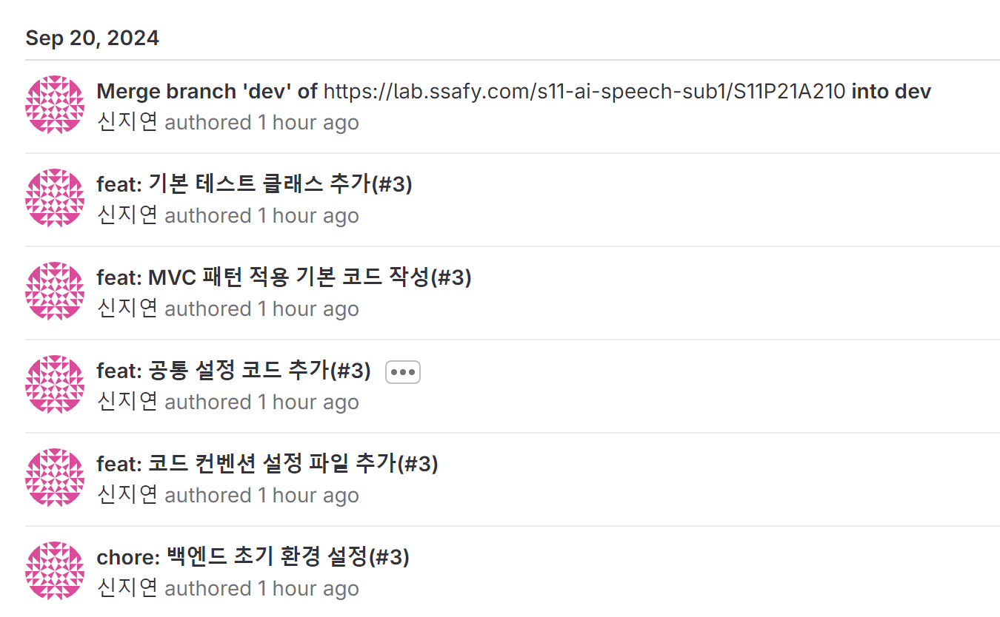

# 240920 기록

> - [1. API 명세서 작성](#1-api-명세서-작성)
> - [2. 서비스 프로세스(?)](#2-서비스-프로세스)
>   - [2-1. 노트 작성](#2-1-노트-작성)
>   - [2-2. 노트 조회](#2-2-노트-조회)
> - [3. 백엔드 환경 구축](#3-백엔드-환경-구축)

# 1. API 명세서 작성

- 대략적인 동작 방식에 대해 얘기를 나누고 API 명세서를 작성하였다.

# 2. 서비스 프로세스(?)
## 2-1. 노트 작성
- 웹 브라우저에서 pdf를 업로드하고 녹음을 시작한다.
- 메모를 작성한다.
    - 프론트엔드에서는 메모가 추가될 때마다 메모-녹음 매핑 JSON을 생성한다.
- 노트 작성을 종료한다.
- 데이터를 저장한다.
    - S3에 pdf와 mp4 파일을 업로드한다.
    - nosql에 메모-녹음 매핑 정보를 저장한다.
- Spring에서 음성 데이터에 대한 분석을 요청한다.
    - Whisper를 이용해 stt와 문장 단위 타임스탬프를 생성한다.
    - 강세 분석 모델로 분석 후 강세가 두드러지는 구간의 타임스탬프를 생성한다.
- AI 모델의 분석이 끝나면 Spring에서 두 정보를 합쳐 하나로 만든다.
- 강의록을 nosql에 저장한다.

## 2-2. 노트 조회
- 웹 브라우저에서 노트 리스트를 조회한다.
- 특정 노트를 클릭한다.
- Spring에 노트 상세 조회 요청이 들어온다.
- 각 저장소에서 데이터를 가져온다.
    - MySQL에서 pdf와 mp4 파일에 대한 S3 url을 조회한다.
    - nosql db에서 메모-녹음 매핑 정보와 강의록을 조회한다.
- Spring은 조회된 데이터를 모아 웹 브라우저에게 보내준다.

# 3. 백엔드 환경 구축

- 각종 config 코드, swagger, 도메인 기본 코드를 작성하였다.