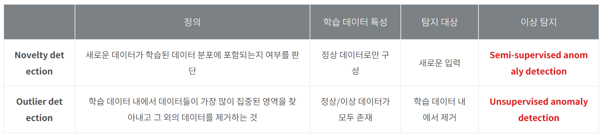

# 240923 기록

# 목차
> - [1. 관련 개념](#1-관련-개념)
>   - [1-1. Prosodic](#1-1-prosodic)
>   - [1-2. Formant](#1-2-formant)
>   - [1-3. speech rate](#1-3-speech-rate)
> - [2. Myprosody](#2-myprosody)
>   - [2-1. 후기](#2-1-후기)
> - [3. 이상탐지](#3-이상탐지)
>   - [3-1. 정의](#3-1-정의)
>   - [3-2. Isolation Forest](#3-2-isolation-forest)
> - [4. 전반적인 방식](#4-전반적인-방식)
> - [5. 기타 참고링크](#5-기타-참고링크)

# 1. 관련 개념

## 1-1. Prosodic
- [Wikipedia 운율(언어학)](https://ko.wikipedia.org/wiki/운율_(언어학))
- 성조, 억양, 강세, 리듬, 음장을 포괄하는 용어

### 관련 라이브러리
- https://disvoice.readthedocs.io/en/latest/Prosody.html
- https://github.com/pilarOG/prosodic-analysis
- https://github.com/YannickJadoul/Parselmouth

## 1-2. Formant
- 우리말로는 ‘음형대’
- 소리가 공명되는 특정 주파수 대역

## 1-3. speech rate
- 말하는 속도
- 영어의 경우 평균적으로 150 wpm (2.5 wps)라고 한다 ([참고](https://www.typingmaster.com/speech-speed-test/))

# 2. Myprosody
- https://github.com/Shahabks/myprosody
- 피치
- 빠르기
    - speech rate
- 크기

## 2-1. 후기
- 전체 음성 데이터에 대한 평균, 최대, 최소값만 찾아낸다.
- 본인은 평균 or 중간 or 최빈값을 벗어나는 **구간**을 찾고싶은데 얘는 그렇지 못하다.

# 3. 이상탐지
## 3-1. 정의
- https://meetup.nhncloud.com/posts/362
- 자신만의 기준을 바탕으로 **특이한 값, 보기 드문 사건을 탐지**하는 일
- 이상(anomaly)은 Novelty와 Outlier로 다시 구분지을 수 있다.
    - Novelty(새로운 것): 한 번도 등장한 적 없는 완전히 새로운 형태의 데이터
    - Outlier(이상점): 다른 데이터와 확연하게 다른 데이터 (새로운 형질이라는 느낌?)
    
    
    
- 이런 점에서 우리 프로젝트는 **Outlier Detection**에 속한다고 볼 수 있다.
    - 다만 음성 데이터이기 때문에 **시계열(time series) 특성**을 가진다는 점에 유의해야 한다.
- 이상탐지는 대부분 비지도 학습으로 이뤄진다.
    - 이는 이상탐지의 정의를 생각해보면 알 수 있다.
    - Outlier에 대한 사전 레이블이 없는 경우가 대부분이다.
    - 지도학습을 하는 경우에는 사실상 이진분류라고 봐도 된다.

## 3-2. Isolation Forest
- 바이너리 트리를 활용한 이상 탐지 알고리즘
- 의사결정나무를 지속적으로 분기시키면서 모든 데이터 관측치의 고립 정보 여부에 따라 이상치를 판별

# 4. 전반적인 방식
- Parselmouth로 음성 데이터에서 필요한 특성만 뽑아낸다.
- sklearn의 IsolationForest 모델을 통해 Outlier를 찾아낸다.
- 추출된 타임스탬프를 적절히 덩어리로 묶는다.

# 5. 기타 참고링크
- https://velog.io/@dgk089/프로젝트-발표의-참견
- https://xiang32.tistory.com/21