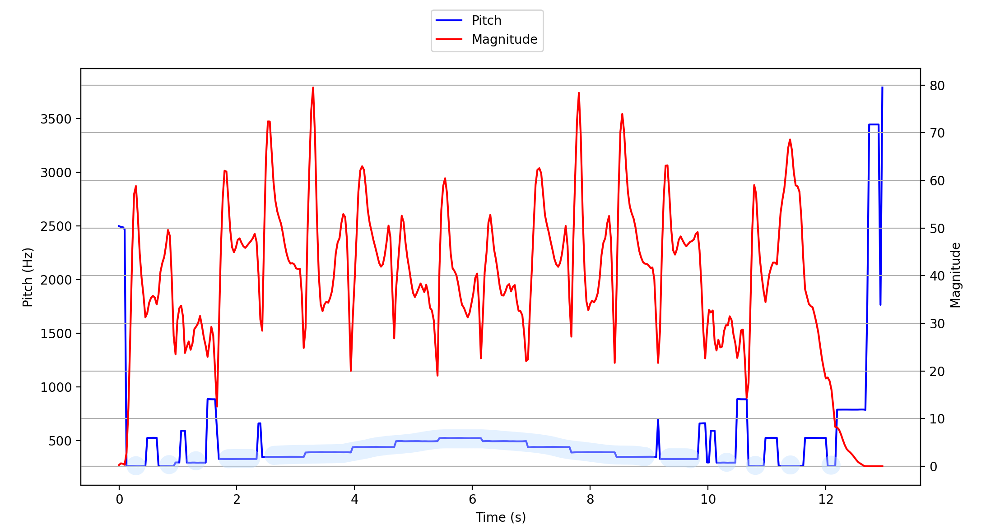
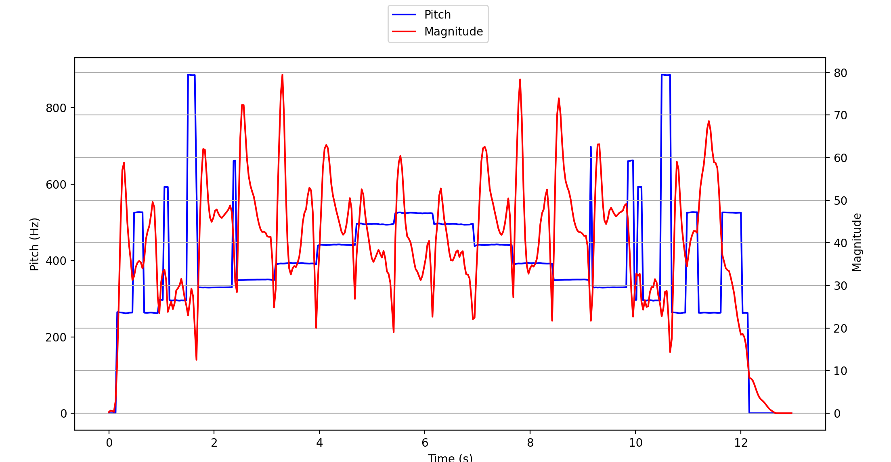

# 240924 기록


# 1. 데이터 전처리
## 1-1. 음성 데이터의 특성
https://velog.io/@jsyeon/음향학

### Magnitude(크기)
- 주파수 영역에서의 개념
- 주파수 영역에서 각 주파수 성분의 세기(절대값)
    - 푸리에 변환 등에서 사용되는 용어이다.
- Amplitude의 절대값 == Magnitude

### Amplitude(진폭)
- 시간 영역에서의 개념
- 파동의 높이
- 음량과 관련이 있는 데이터

### Decibel
- 음압의 단위인 bel의 10배 단위

### 샘플 레이트
 현실 세계에서 소리는 연속된 데이터이다. 컴퓨터는 모든 데이터를 이산적으로 처리한다. 그렇기에 녹음된 음성 파일은 마치 그래프를 미분하듯이 끊어진 순간순간의 값들을 갖게 된다. 즉, **음성 데이터는 1차원 배열**인 셈이다.

 그렇다면 연속적인 값을 얼마만큼의 간격으로 끊어내는가? 이에 대한 개념이 **sample rate(샘플 레이트)**이다.

 sample rate는 Hz(헤르츠) 단위로 표시된다. sample rate가 44,100Hz라는 것은 1초에 44,100개의 데이터를 기록해낸다는 것을 의미한다. 구분구적법을 배울 때 세밀하게 쪼갤 수록 실제 값에 가까워지듯이, sample rate도 값이 클수록 원본 아날로그 데이터(현실 세계의 음성)과 가까워진다. 즉, sample rate가 높을 수록 음질이 좋다. bit rate라는 개념도 있던데 현재 프로젝트와는 큰 관계가 없는 것 같기에 패스한다.

---

## 1-2. down sampling

 sample rate가 높다고 무조건 좋다고 할 수 없다. 동일한 아날로그 음성에 대해 sample rate가 더 높다면 그만큼 기록되는 데이터가 많아지게 된다. sample rate가 높으면 파일 용량이 커지고, 너무 긴 1차원 배열은 모델 학습에 바로 사용하기 난감하다.

 또한 오디오를 이미지로 변환 후 모델에 학습시키는 경우, sample rate가 높으면 모든 데이터를 이미지에 함축하지 못할 수 있다고 한다. ([참고](https://kaen2891.tistory.com/38)) 

 그렇기에 **down sampling**을 이용해 배열의 길이를 줄여야 한다.(중간중간의 값들을 날리는 느낌인가) 반대로 **up sampling**이라는 방법도 존재한다. 얘는 띄엄띄엄 추출된 값을 촘촘하게 추출된 것처럼 값들을 추가하는 기법인듯 하다.

 파이썬으로 음성 데이터 처리할 때 보통 `librosa` 라이브러리가 사용된다. 여기서 down sampling 기능도 제공해주는데(정확히는 re-sampling), `llibrosa.resample` 메소드를 써주면 된다.

 음성 인식/처리에는 보통 16000Hz로 맞춰서 한다고 한다.

```python
import librosa
audio_data, sample_rate = librosa.load(file_path, sr=16000)
```

---

## 1-3. 푸리에 변환

https://velog.io/@eunjnnn/Understanding-the-Mel-Spectrogram

 음성 데이터는 여러개의 single-frequency 들이 중첩된 결과물이다. 

## 1-4. 스펙트로그램

- 시간에 따른 신호 주파수의 스펙트럼 그래프

# 2. feature 추출

## 2-1. Pitch

https://en.wikipedia.org/wiki/Transcription_(music)#Pitch_detection

https://github.com/CreativeDetectors/PitchScope_Player

### 문제 1 - 소리가 없는 부분에서 pitch가 튐

 [Major Scale 영상](https://www.youtube.com/watch?v=vTJhpjIA0Fc)에서 오디오를 따와서 librosa로 feature를 뽑아봤다. 참고로 C4~C5이므로 예상대로라면 262Hz~523Hz 범위로 그래프가 그려져야 한다. 결과는 아래와 같다.



 pitch에서 하늘색 하이라이트 부분이 정상적으로 검출된 부분이다. 두 그래프를 함께 보면 소리가 나지 않는데 주파수가 튀는 부분을 볼 수 있다. (특히 각 끝부분이 심하다)

 각 time frame에서 pitch를 계산할 때 magnitude가 가장 큰 주파수 대역을 선택하도록 했다. 그러면 실제 magnitude가 어떤지를 보면 되지 않을까?

```python
# 각 시간 프레임별로 가장 큰 진폭을 가진 주파수(피치)를 선택한다.
pitches_selected = []
for time_frame in range(pitch_data.shape[1]):
    max_index = magnitude_data[:, time_frame].argmax()  # 진폭이 가장 큰 인덱스
    pitch = pitch_data[max_index, time_frame]  # 해당 인덱스의 피치
	
		# time in seconds = (time_frame * hop_length) / sample_rate
    print("time: " + str((time_frame * n_fft / 4) / sample_rate) + ", pitch:" + str(pitch) + ", volume: " + str(magnitude_data[max_index, time_frame]))
    pitches_selected.append(pitch)
```

```
(magnitude가 정확하지만... 의미상 volume으로 썼다.)
time: 0.0, pitch:2498.4983, volume: 0.2598683   
time: 0.032, pitch:2490.9812, volume: 0.60908395
time: 0.064, pitch:2489.5051, volume: 0.5368102 
time: 0.096, pitch:2468.3354, volume: 0.31761605
time: 0.128, pitch:265.12476, volume: 2.7917929 
time: 0.16, pitch:264.8816, volume: 12.240322   
time: 0.192, pitch:264.2484, volume: 27.606884  
time: 0.224, pitch:263.89645, volume: 44.659763 
time: 0.256, pitch:263.5666, volume: 57.08423   
time: 0.288, pitch:262.5855, volume: 58.79427   
time: 0.32, pitch:261.6234, volume: 52.570415   
time: 0.352, pitch:262.17822, volume: 44.684937 
time: 0.384, pitch:263.3361, volume: 39.506138 
(중략)
time: 12.032, pitch:262.68234, volume: 18.63761
time: 12.064, pitch:263.0911, volume: 17.90332
time: 12.096, pitch:263.15347, volume: 16.052044
time: 12.128, pitch:262.60333, volume: 12.279229
time: 12.16, pitch:262.54297, volume: 8.271836
time: 12.192, pitch:789.0392, volume: 8.152339
time: 12.224, pitch:789.0482, volume: 7.692346
time: 12.256, pitch:789.2486, volume: 6.738936
time: 12.288, pitch:789.51404, volume: 5.5688777
time: 12.32, pitch:789.72864, volume: 4.4957757
(중략)
time: 12.864, pitch:3445.3125, volume: 1.5204024e-05
time: 12.896, pitch:3445.3125, volume: 1.5287027e-05
time: 12.928, pitch:1765.6998, volume: 1.5269612e-05
time: 12.96, pitch:3789.754, volume: 1.2407307e-05
```

 볼륨이 엄청 작은데 피치가 튀는 구간이 확인됐다. 아마 백색 소음이나 전자기기의 희미한 노이즈가 아닐까 생각된다. 일단 볼륨이 충분히 작은 경우에는 pitch를 0으로 처리해야겠다. 일단 **8**을 기준으로 잡아보겠다.

```
time: 0.384, pitch:263.3361, volume: 39.506138  
time: 0.416, pitch:263.50983, volume: 35.84609  
time: 0.448, pitch:263.75754, volume: 31.26408  
time: 0.48, pitch:525.32074, volume: 32.14883   
time: 0.512, pitch:525.9209, volume: 34.310585  
time: 0.544, pitch:526.5927, volume: 35.328342
time: 0.576, pitch:526.7655, volume: 35.74916
time: 0.608, pitch:526.4561, volume: 35.4096
time: 0.64, pitch:526.343, volume: 33.96024    
time: 0.672, pitch:263.4994, volume: 36.078465  
time: 0.704, pitch:263.0907, volume: 40.821434  
time: 0.736, pitch:263.1339, volume: 42.66774
```

 다만 별 이유없이 피치가 튀는 구간도 존재한다. gpt 선생님께 여쭤보니 아래의 문제가 원인일 수 있다고 하셨다.

- 노이즈
- Hop Length가 너무 큰 경우 (피치 변화에 대한 반응이 느려진다.)
- `stft` 메서드의 `n_fft` 파라미터가 잘못 설정된 경우
    - 2048 또는 4096을 사용하라고 조언
- `librosa.piptrack()` 자체의 한계



일단 magnitude가 작은 부분에 대해 처리를 해줬다. pitch 그래프가 조금은 개선됐다.


# 3. 기타 참고
- [https://velog.io/@jsyeon/음향학](https://velog.io/@jsyeon/%EC%9D%8C%ED%96%A5%ED%95%99)
- https://velog.io/@sbs524/음성-인식-기초-데이터-전처리-종결-1
- https://www.openslr.org/51/