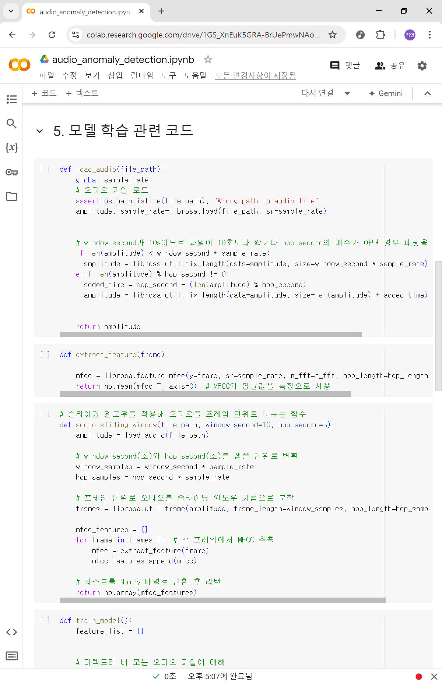

# 240926 기록

# 1. 코드 작성

- isolation forest 알고리즘을 이용한 이상 탐지 모델 학습 코드를 작성했다.
- 일단 코드 작성에 준비하느라 데이터셋은 [감성 및 발화 스타일별 음성합성 데이터](https://www.aihub.or.kr/aihubdata/data/view.do?currMenu=115&topMenu=100&aihubDataSe=data&dataSetSn=466)를 임시로 사용했다.
- 근데 결과가 영 좋지 못하다.

    - [한석원 - 보는 순간 달라지는 기출 사용설명서](https://www.youtube.com/watch?v=PTezM5F76P8) 영상의 오디오를 input으로 넣고 시험을 돌려봤는데 모든 구간이 정상적이라는 결과가 나왔다.
- 이상 탐지를 위해서 어떤 종류의 데이터가 필요한지 좀 더 고민을 해봐야겠다.