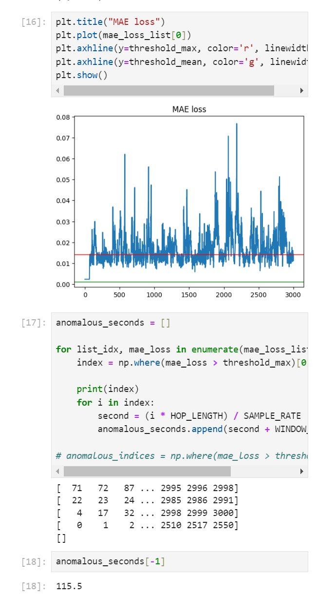

# 240926 기록

# 1. 모델 학습 및 결과 도출 완료

- 발화 중 강조되는 부분을 탐색하는 모델을 완성하였다.
- feature는 mfcc, 딥러닝 알고리즘은 오토인코더, 손실함수는 mae를 사용하였다.
- GPU 사용을 위한 환경설정 부터 학습 데이터 조작에 많은 어려움을 겪어 많은 삽질을 했다.
- threshold를 어떻게 지정하는 게 좋을지 아직 잘 모르겠다. 일단은 정상 데이터에 대한 mae 중 최대값을 사용하고 있는데 완전히 격하게 말한 경우에는 확실히 잡아내고, 애매하게 격해진 경우는 못 잡아낸다.
- threshold를 정상 데이터로부터 뽑아내서 써야하는지, 이상 데이터에서 매번 뽑아내서 써야할지 모르겠다.
- 이 부분은 실제 데이터를 넣어보면서 확인해야 할 것 같다.